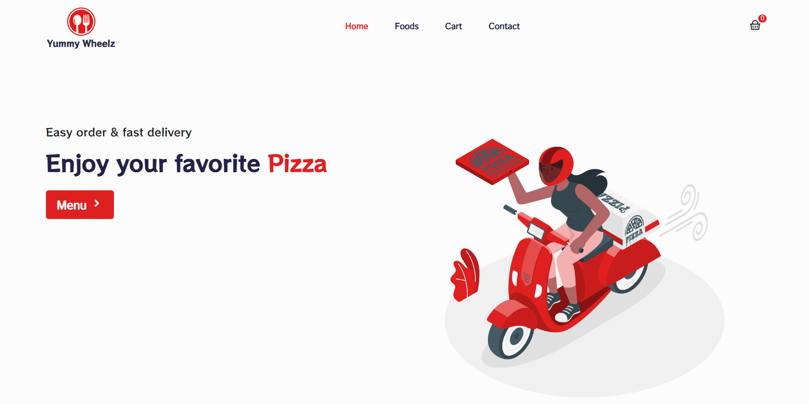

# Yummy Wheelz Pizza Delivery 

Welcome to Yummy Wheelz Pizza Delivery, your go-to app for ordering delicious pizzas straight to your doorstep! 

Click on :point_right:  [Yummywheelz](https://yummywheelzpizza.netlify.app/) to see the project in action.

## Overview

Yummy Wheelz Pizza Delivery simplifies the process of ordering pizza online. With our app, you can browse through a variety of pizzas, customize your order, and have it delivered quickly. Whether you're craving classic pepperoni or adventurous with exotic toppings, we've got you covered.

## Features

- **Browse Menu**: Explore our diverse pizza menu.
- **Secure Payments**: Safe and convenient payment options integrated into the app.
- **User Friendly**: User Friendly Interface.

## Installation

To get started with Yummy Wheelz Pizza Delivery, follow these steps:

1. Clone this repository: https://github.com/aryansainias/YummyWheelz-Pizza-App.git
2. Navigate to the project directory: cd yummy-wheelz

Run Script-
  
1. npm i   (To install all the dependencies)
2. npm start (Command is used to start a project)

### Technologies Used:

1. React.js
2. Redux Toolkit
3. ReactStrap
4. CSS

### License
This project is licensed under the MIT License.

